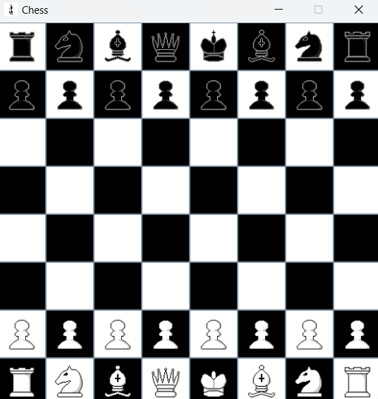

# **Java Chess Game**<br>
This is a simple Chess Game developed in Java, providing a classic two-player chess experience. The game follows standard chess rules, with the goal of checkmating the opponent's king.

**Features**<br>

Graphical User Interface (GUI): The game includes a chessboard rendered in a grid with pieces displayed as icons.
Two-player functionality: Players can take turns moving pieces according to standard chess rules.
Chess Pieces: Supports all standard chess pieces - King, Queen, Bishop, Knight, Rook, and Pawns.

**Project Structure**<br>

chess.java: The main class which launches the game.<br>
board.java: Handles the chessboard setup and piece positions.<br>
ui.java: Defines the logic of graphical user interface using JFrame.<br>

**How to Run the Project**<br>

Clone the repository:<br>
```console
git clone https://github.com/neev-ahuja/chess-java.git
```

Run the Game:
```console
java chess.java
```
**Screenshots**<br>



**Future Enhancements**<br>

Legal Moves: Enforces legal moves for each piece, including special moves like castling, en passant, and pawn promotion .<br>
Check and Checkmate Detection: Recognizes check and checkmate conditions .<br>
AI Opponent: Implement an AI player to allow single-player gameplay.<br>
Undo/Redo Moves: Add functionality to undo or redo moves.<br>
Timed Games: Add timers for competitive play.<br>
Multiplayer over Network: Support for online multiplayer chess matches.<br>
